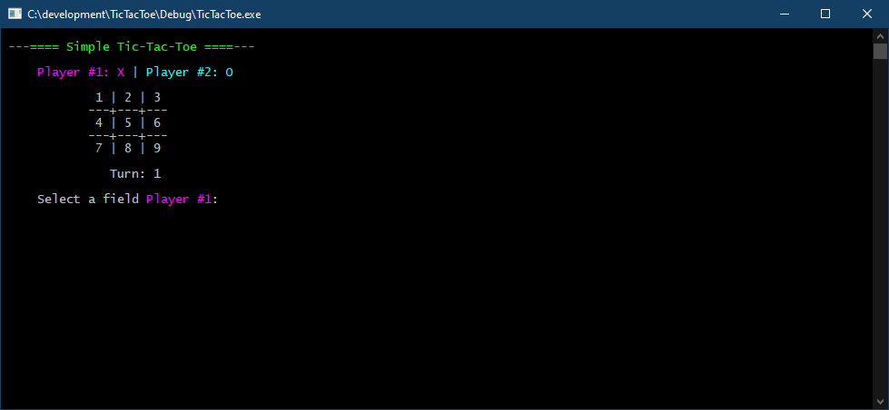

# Simple Tic-Tac-Toe

This is a simple tic-tac-toe game implemented in C++. Use Visual Studio 2019 to build.

Basic features:
* Multi-color UI
* Scorekeeping after first game
* Undo moves using 'u'
* Game board state held in one dimension array
* Less then 300 lines of code including comments

